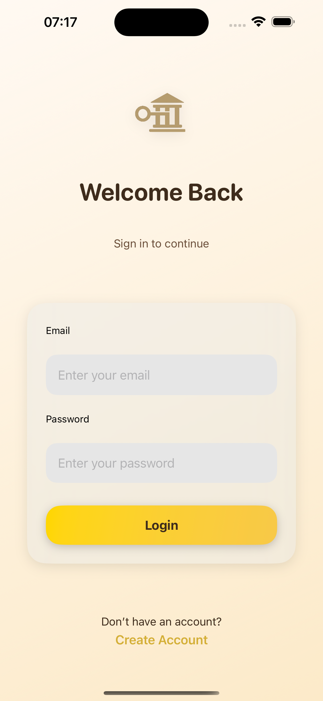
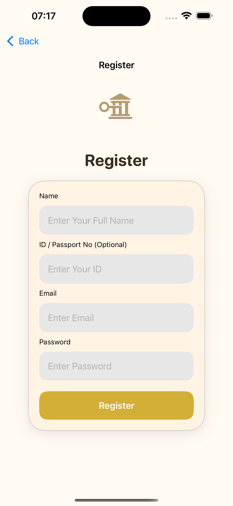
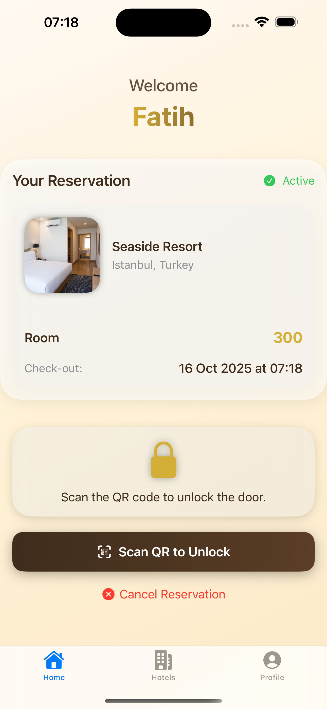
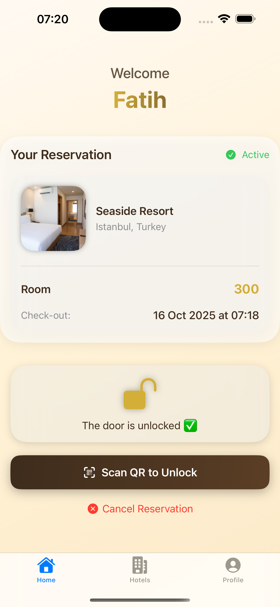
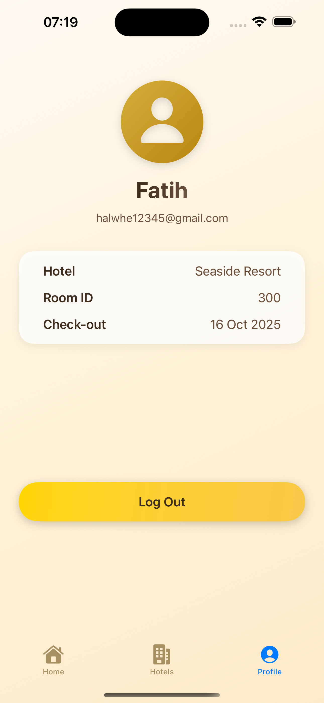

## keyInn
KeyInn is a SwiftUI-based mobile app that simplifies hotel check-in and room access by replacing physical key cards with QR-based access and fast digital registration. Users can register using their national ID (TC), book a room and open the door via QR — no cards to carry, lose or exchange.

## ✨ Overview

KeyInn aims to make hotel stays faster, safer and frictionless by:
- Enabling quick digital registration (TC identity input) for guests,
- Providing QR-based door unlocking tied to reservations,
- Removing the need for physical key cards (no carrying, handing over, or replacing cards),
- Improving both user convenience and hotel operational flow.

## 🧰 Built With

- Swift & SwiftUI  
- MVVM architecture  
- Firebase (Authentication, Firestore)  
- CodeScanner (QR scanning)  
- Local/remote API for lock/unlock (sample integration)

  ## 🚀 Quick Start / Installation

1. Clone the repo:
   ```bash
   git clone https://github.com/<your-username>/KeyInn.git
   cd KeyInn

## 🖼️ Screenshots

Below are some preview screens from **KeyInn**, showing the complete hotel booking and QR-based access experience.

| Login | Register | Select Hotel | Hotel Info |
|:---:|:---:|:---:|:---:|
|  |  |  |  |

| Book Now | Home | QR Unlock | Profile |
|:---:|:---:|:---:|:---:|
|  |  |  |  |
